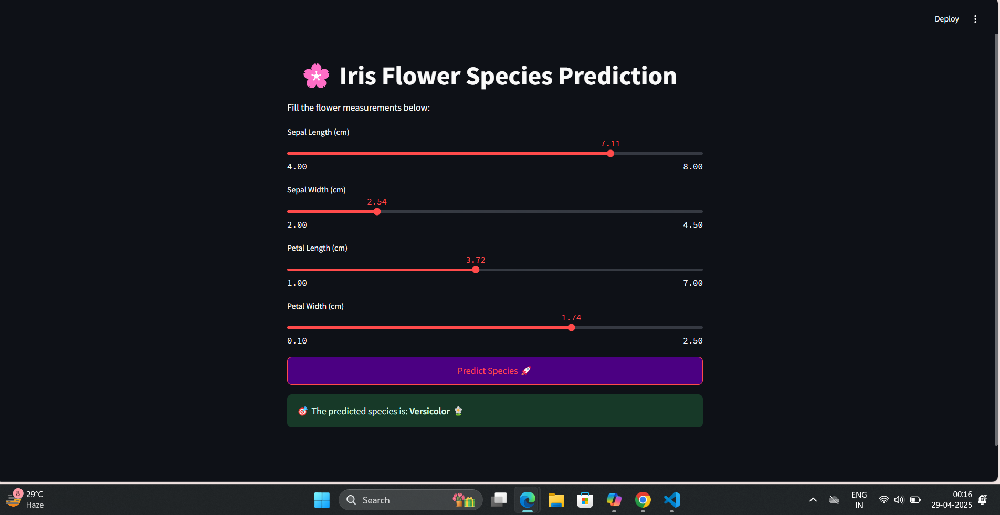
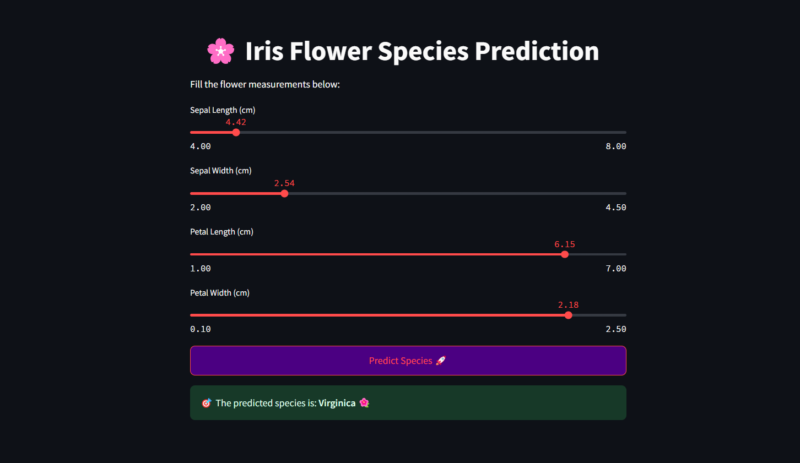
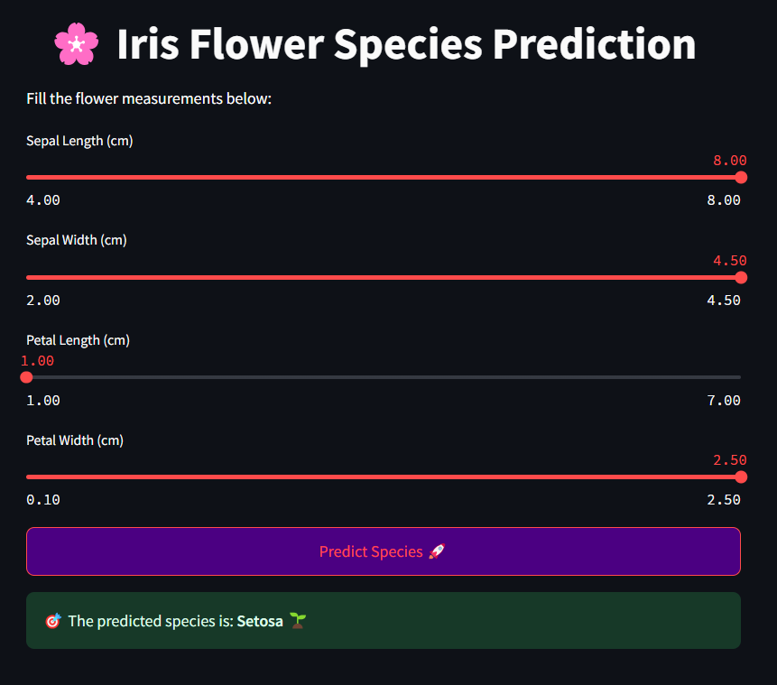

## 📚 Project Overview
Machine Learning model to classify Iris flower species using scikit-learn.  
Achieved **100% accuracy** with Logistic Regression.  
Includes EDA, feature importance analysis, model evaluation, and model saving.

## 📂 Dataset
- Source: [Kaggle - Iris Flower Dataset](https://www.kaggle.com/datasets/arshid/iris-flower-dataset)

## 🛠 Technologies Used
- Python
- Pandas, NumPy
- Scikit-learn
- Matplotlib, Seaborn

## 🚀 Steps Involved
- Data Cleaning and Preprocessing
- Exploratory Data Analysis (EDA)
- Feature Importance Analysis
- Model Building (Logistic Regression, KNN, SVM, Decision Tree, Random Forest)
- Model Evaluation and Comparison
- Best Model Saving (`best_model.pkl`)

## 📈 Results
- Best Model: **Logistic Regression**
- Final Accuracy: **100%**
- 10-fold Cross-Validation confirmed model stability.

## 📄 How to Run
```bash
git clone https://github.com/your_username/iris-flower-classification.git
cd GrowthLink_DS
pip install -r requirement.txt
jupyter notebook

## 🖼 Output Screenshots

### Screenshot 1


### Screenshot 2


### Screenshot 3



